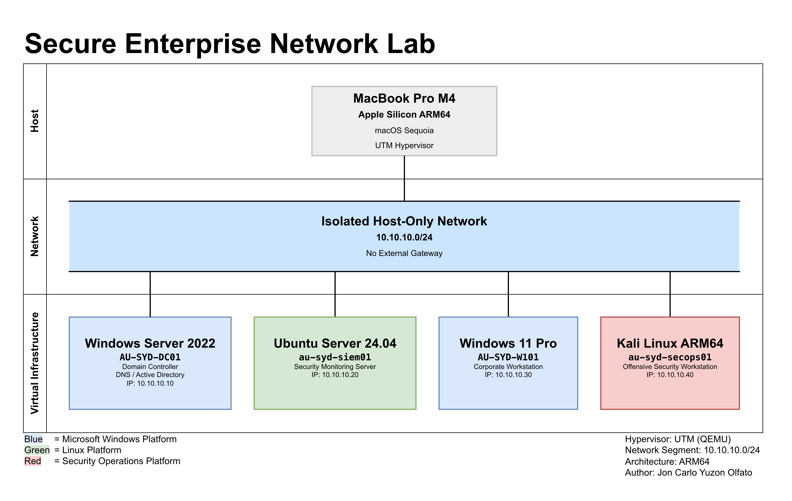

# Secure Enterprise Network Lab


> Enterprise-style virtual infrastructure built on UTM/QEMU for Active Directory, Governance, Risk & Compliance (GRC), Cloud Security, and Security Operations laboratory projects.

---

## Project Overview

The **Secure Enterprise Network Lab** is a self-contained virtual infrastructure designed to simulate an enterprise banking security environment using an isolated private network. The laboratory serves as the foundational platform for a series of interconnected cybersecurity projects focused on enterprise identity management, governance and compliance, cloud security, and security monitoring.

The environment is deployed entirely on **UTM (QEMU)** running on an Apple Silicon MacBook Pro and utilises a dedicated **10.10.10.0/24 host-only network** to ensure complete isolation from external production environments.

Rather than functioning as a standalone virtual machine lab, this repository represents the core infrastructure upon which the remaining enterprise portfolio projects are built.

---

## Key Technologies

| Category | Technologies |
| ---------- | -------------- |
| Virtualisation | UTM, QEMU, Apple Silicon ARM64 |
| Operating Systems | Windows Server 2022, Windows 11 Pro, Ubuntu Server 24.04 LTS, Kali Linux ARM64 |
| Identity Services | Active Directory Domain Services, DNS |
| Networking | TCP/IP, IPv4 addressing, Host-Only Networking, Static IP Configuration |
| Security Operations | Kali Linux, Security Testing Workflows, Infrastructure Validation |
| Documentation | GitHub, Markdown, Draw.io Architecture Diagrams |

---

## Project Objectives

This project was designed to:

- Build a reusable enterprise laboratory using UTM on Apple Silicon.
- Deploy a fully isolated private network using the **10.10.10.0/24** subnet.
- Configure production-style host naming conventions and static IP addressing.
- Establish a Windows Server domain foundation using the **banking.lab** Active Directory domain.
- Prepare baseline infrastructure for Identity & Access Management (IAM), Governance, Risk & Compliance (GRC), Cloud Security, and Security Operations projects.
- Produce professional documentation and technical validation suitable for an enterprise cybersecurity portfolio.

---

## Lab Environment

| Component | Specification |
| --- | --- |
| Host Platform | Apple MacBook Pro M4 |
| Memory | 24GB Unified Memory |
| Storage | 1TB SSD |
| Host Operating System | macOS Sequoia |
| Hypervisor | UTM (QEMU) |
| Guest Architecture | ARM64 |
| Network Type | Host-Only Private Network |
| Network Address | 10.10.10.0/24 |
| Active Directory Domain | banking.lab |

---

## Enterprise Architecture

The laboratory consists of four virtual machines representing common enterprise infrastructure components found within corporate environments.



---

## Virtual Machine Inventory

| Hostname | Operating System | IP Address | Primary Function |
| ----------- | ------------------ | ------------ | ----------------- |
| AU-SYD-DC01 | Windows Server 2022 | 10.10.10.10 | Domain Controller (DNS / Active Directory) |
| au-syd-siem01 | Ubuntu Server 24.04 LTS | 10.10.10.20 | Security Monitoring Server |
| AU-SYD-W101 | Windows 11 Pro | 10.10.10.30 | Corporate Workstation |
| au-syd-secops01 | Kali Linux ARM64 | 10.10.10.40 | Offensive Security Workstation |

---

## Network Design

| Network Configuration | Value |
| ---------------------- | ------- |
| Network Type | Host-Only |
| Address Space | 10.10.10.0/24 |
| Gateway | None |
| Internet Access | Disabled after initial provisioning |
| DNS | Windows Server 2022 Domain Controller |
| Static Addressing | Configured on all virtual machines |

The absence of a default gateway intentionally isolates the environment from external networks while allowing unrestricted communication between virtual machines inside the laboratory.

---

## Deployment Summary

The baseline environment was built using four enterprise virtual machines deployed within an isolated UTM virtual network.

Completed activities include:

- Deployment of Windows Server 2022
- Deployment of Windows 11 Pro
- Deployment of Ubuntu Server 24.04 LTS
- Deployment of Kali Linux ARM64
- Static IP configuration
- Active Directory domain controller foundation
- DNS configuration
- Host-only network isolation
- SSH validation (Ubuntu)
- Guest tools installation
- Connectivity validation
- Baseline virtual machine backup

The completed environment provides a stable platform for future identity, governance, cloud security, and security operations projects.

---

## Validation

Each virtual machine was validated following deployment to ensure a consistent enterprise baseline.

Validation activities included:

- UTM virtual network verification
- Static IP validation
- Operating system validation
- Package update verification
- Active Directory validation
- DNS validation
- Domain membership validation
- Network connectivity testing
- Service health verification

Supporting evidence is available within the repository under the **screenshots/** directory.

---

## Documentation

Detailed technical documentation for the Secure Enterprise Network Lab is available below.

| Document | Description |
| -------- | ----------- |
| [Network Design](documentation/network-design.md) | Enterprise network architecture, network segmentation, hostname convention, and IP addressing design |
| [Deployment Guide](documentation/deployment-guide.md) | Infrastructure deployment methodology, implementation phases, and baseline configuration process |
| [Validation Report](documentation/validation-report.md) | Infrastructure validation evidence, connectivity testing, and service verification |
| [Security Considerations](documentation/security-considerations.md) | Security architecture decisions, network isolation, and planned security enhancements |
| [Hostname Convention](configuration/hostname-convention.md) | Enterprise hostname standard and asset naming convention |
| [IP Addressing Plan](configuration/ip-addressing-plan.md) | Static IPv4 allocation strategy and network addressing plan |
| [Virtual Machine Specifications](configuration/vm-specifications.md) | Virtual machine inventory, hardware allocation, and hypervisor configuration |

Additional project resources:

- **Architecture diagrams:** [`diagrams/`](diagrams/)
- **Validation screenshots:** [`screenshots/`](screenshots/)
- **Configuration standards:** [`configuration/`](configuration/)

---

## Repository Structure

```text
secure-enterprise-network-lab
|
├── LICENSE
├── README.md
|
├── assets/
│   └── .gitkeep
|
├── configuration/
│   ├── hostname-convention.md
│   ├── ip-addressing-plan.md
│   └── vm-specifications.md
|
├── diagrams/
│   ├── enterprise-network-topology.drawio
│   └── enterprise-network-topology.png
|
├── documentation/
│   ├── deployment-guide.md
│   ├── network-design.md
│   ├── validation-report.md
│   └── security-considerations.md
|
└── screenshots/
    ├── kali-linux-secops01/
    ├── ubuntu-siem01/
    ├── windows-11-pro-w101/
    └── windows-server-2022-dc01/
```

---

## Skills Demonstrated

This project demonstrates practical experience across:

- Enterprise Infrastructure Deployment
- Windows Server Administration
- Linux System Administration
- Active Directory Foundations
- DNS Configuration
- Static IP Address Management
- TCP/IP Networking
- Virtualisation using UTM (QEMU)
- Infrastructure Documentation
- Git & GitHub Version Control
- Technical Validation
- Enterprise Network Design
- Network Segmentation
- Security Architecture Documentation

---

## Future Project Dependencies

This repository serves as the foundational infrastructure for the following enterprise portfolio projects:

| Repository | Purpose |
| ------------ | --------- |
| enterprise-banking-iam-architecture | Enterprise Active Directory, RBAC, Group Policy, Tiered Administration |
| enterprise-banking-grc-assessment | ACSC Essential Eight, APRA CPS 234 and ISO 27001 compliance assessment |
| cloud-banking-infrastructure-hardening | AWS security configuration, IAM, CIS Benchmarks and cloud hardening |
| enterprise-banking-siem-sentinel | Microsoft Sentinel deployment, KQL analytics and security monitoring |

Together, these repositories form an interconnected enterprise cybersecurity portfolio simulating the progressive implementation of security controls within a corporate banking environment.

---

## Disclaimer

This repository documents a self-contained laboratory environment created for professional development and portfolio purposes.

The environment is fully isolated from production systems and does not contain organisational data or live customer information. All hostnames, IP addressing, domain names, and infrastructure components are intended solely for educational demonstration and cybersecurity skills development.
